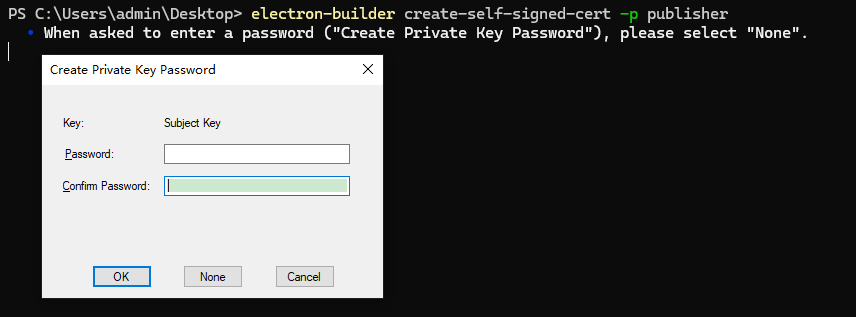

## 获取自签名证书

```sh
electron-builder create-self-signed-cert -p publisher
# Create self-signed code signing cert for Windows apps
# Options:
#       --version    Show version number                                 [boolean]
#       --help       Show help                                           [boolean]
#   -p, --publisher  The publisher name                        [string] [required]
```

密码选None



## 配置

```js
/**
 * @type {import('electron-builder').Configuration}
 * @see https://www.electron.build/configuration/configuration
 */
module.exports = {
  // 省略
  signtoolOptions: {
      certificateFile: 'resources/certificate.pfx',
      signingHashAlgorithms: ['sha256'],
  },
}
```

:::info
electron-builder@25.1.8 版本下适用
:::