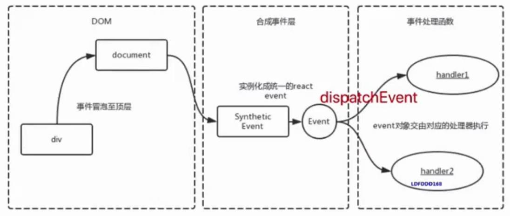
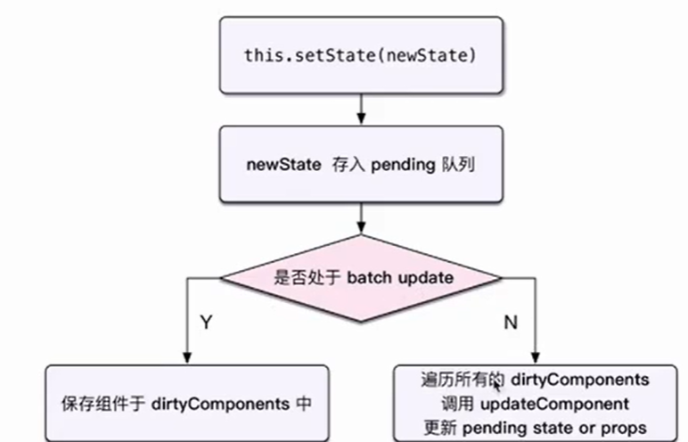

## [React 生命周期](https://projects.wojtekmaj.pl/react-lifecycle-methods-diagram/)

## vdom diff 算法思想

- 只比较同一层级,不跨级比较
- tag 不相同,则直接删除重建,不再深度比较
- tag 和 key,两者都相同,则认为相同节点,不再深度比较

## 合成事件

- 所有事件挂载到 document
- event 不是原生的,是 SyntacticEvent 合成事件对象,模拟出来 DOM 事件所有能力
- 和 Vue 事件不同,和 DOM 事件也不同

### 合成事件优点

- 更好的兼容性和跨平台
- 挂载到 document,减少内存消耗,避免频繁解绑
- 方便事件的统一管理(如事务机制)

## setState 和 batchUpdate

### setState

- 通常异步(普通使用),有时同步(setTimeout,DOM 事件)
- 有时合并(对象形式),有时不合并(函数形式)

### setState 是异步还是同步

- setState 无所谓异步还是同步
- 看是否能命中 batchUpdate 机制
- 判断 isBatchingUpdates (执行方法前:isBatchingUpdates=true;执行方法后:isBatchingUpdates=false)

### 那些能命中batchUpdate机制

- 生命周期(和它调用的函数)
- React中注册的事件(和它调用的函数)
- React可以 "管理" 的入口

## React组件渲染和更新过程

### 组件渲染过程

- props state
- render() 生成 vnode
- patch(elem,vnode)

### 组件更新过程

- setState(newState)->dirtyComponents
- render() 生成 newVnode
- patch(vnode,newVnode)

### fiber

- 将 reconciliation 阶段进行任务拆分(commit无法拆分)
- DOM 需要渲染时暂停,空闲时恢复
- window.requestIdleCallback

## 面试题

### 组件之间如何通讯

- 父子组件props
- 自定义事件
- Redux 和 Context

### Context 是什么,如何应用

- 父组件,向其下所有子孙组件传递信息
- 一些简单的公共信息:主题,语言

### React性能优化

- 渲染列表使用key
- 自定义事件,DOM事件及时销毁
- 合理使用异步组件
- 减少函数 bind this 的次数
- 合理使用SCU PureComponent 和 memo
- 合理使用 Immutable.js
- 使用SSR