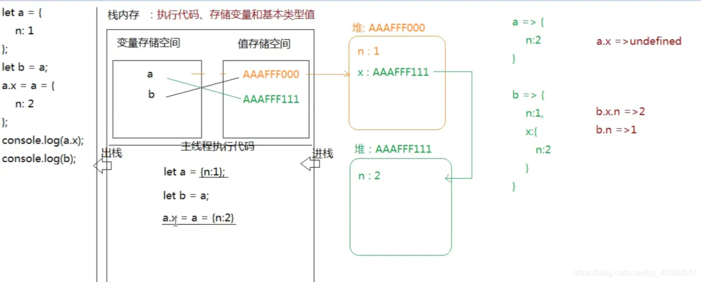

## [JS 的 8 种数据类型及区别](https://developer.mozilla.org/zh-CN/docs/Web/JavaScript/Data_structures)

最新的 ECMAScript 标准定义了 8 种数据类型:

- 7 种原始类型:

  - Boolean
  - Null
  - Undefined
  - Number
  - BigInt
  - String
  - Symbol

- Object

:::tip
除 Object 以外的所有类型都是不可变的（值本身无法被改变）。这些类型的值为“原始值”。
:::

## [JS堆栈内存的运行机制](https://developer.mozilla.org/zh-CN/docs/Web/JavaScript/Memory_Management)

### 垃圾回收

- 引用计数垃圾收集(限制：循环引用)

这是最初级的垃圾收集算法。此算法把“对象是否不再需要”简化定义为“对象有没有其他对象引用到它”。如果没有引用指向该对象（零引用），对象将被垃圾回收机制回收。

- 标记-清除算法

这个算法把“对象是否不再需要”简化定义为“对象是否可以获得”。

这个算法假定设置一个叫做根（root）的对象（在Javascript里，根是全局对象）。垃圾回收器将定期从根开始，找所有从根开始引用的对象，然后找这些对象引用的对象……从根开始，垃圾回收器将找到所有可以获得的对象和收集所有不能获得的对象。